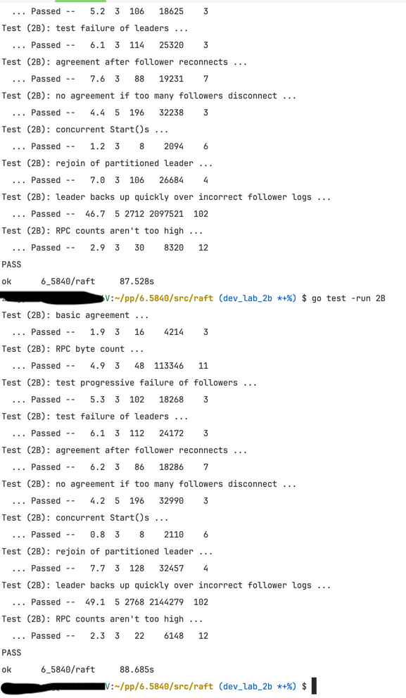

# 概述
lab 2C 要完成的功能是持久化几个字段，标注的是hard。
一开始我嗤之以鼻，10分钟搞定了持久化。
然后花了三天调试完成。😭我错了！
主要问题就是lab 2B的代码不完善，所以在2C后面几个 断连的testcase直接G了。

## 过程
1. Figure 8 后面的几个case 需要修改`AppendEntries`的返回值增加一个commitIndex来标记当前节点提交的进度，否则在频繁切换主节点时，follower的日志简单依靠master的nextIndex就会出现不一致，这个论文里面有说。

2. 一定要在每个持久化数据变更的地方都要调用 `persistent` 方法！！！

3. 再重申一边执行case时加上`-race` 参数

## case截图

## code
答：尽量自己独立完成。

## 附录代码
晚点补充
